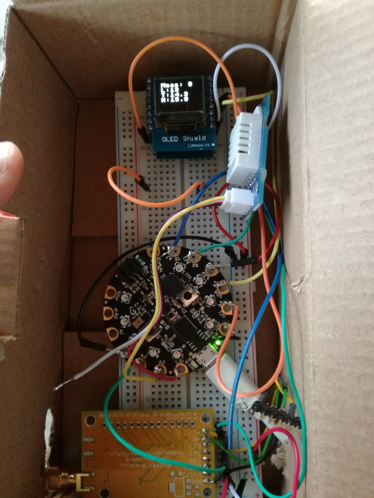

Please see [here for the frontend part and the project description](https://github.com/loleg/pushthebutton-server)

# Hardware

* Adafruit Circuit Playground Express
* Microchip RN2483 LoRa module on a breakoutboard
* A DHT sensor (since the Sensirion SHT I had in my box didn't work)
* A cheap I2C Display (the one which fits on the Wemos d1 mini)

##  Connections

| Circuit Playground |             |
| ------------------ | ----------- |
| A7 TX              | RN2483 RX   |
| A6 RX              | RN2483 TX   |
| A2                 | RN2483 RST  |
| A5 SDA             | Display SDA |
| A4 SCL             | Display SCL |
| A3                 | DHT Signal  |

## Picture

# Code

Since it was written at a hackathon it's probably not the most beautiful code you saw to this day. But it works.

## Features

* Measures every `cycletime` seconds temperature, humidit and luminosity
* Sends the average of those values plus the position of the switch ever `cycles` 
* No interrupts (yet) ;)

## comissioning.txt

Since one of the challenges when you're rolling out LoRaWAN devices, is to bring the comissioning data into every device (and maybe let the user change it), and the SAM21 devices from Adafruit show up as USB-drives I decided to read the data at the start from a textfile, which can easily be edited by the user (and later generated by a webapp for example)